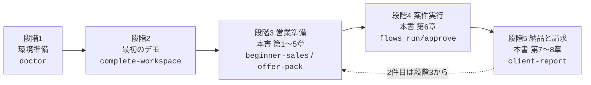
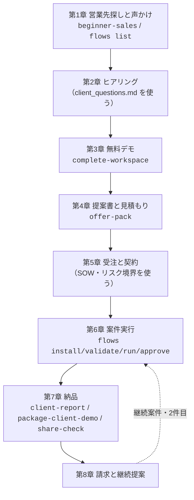
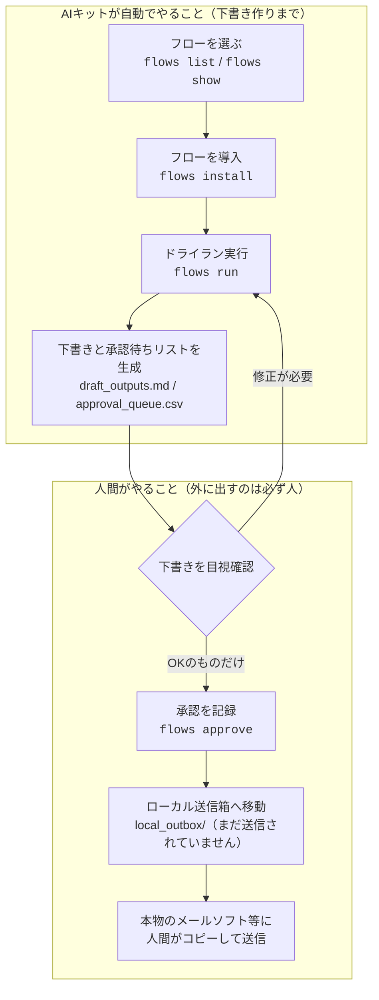

# 中小企業への自動化提案チュートリアル（営業から請求まで）

このチュートリアルは、「AIエージェント（指示を受けて作業を進めてくれるAIのこと）を触り始めたばかりで、副業として中小企業に業務自動化を提案したい」という方のための、エンドツーエンド（最初から最後まで通し）の実践ガイドです。

営業先の見つけ方から、ヒアリング、デモ、提案書、受注、案件実行、納品、請求まで、全工程を8章に分けて説明します。各章に「使うコマンド」「実際の出力例」「よくある失敗」を載せています。出力例は、すべてこのキットを実際に動かして得たものです。

> **はじめに必ず理解してほしい安全設計**: このキットは外部に何も送信しません。メール送信・チャット投稿・本番データの変更は行わず、すべて「下書き」と「承認待ちリスト」としてファイルに出力されます（dry-run＝ドライラン、本番実行しないお試し実行）。**生成 → 人間が確認・承認 → 人間が送る**、が唯一の流れです。だから初心者でも、お客様に迷惑をかける事故が起きません。

> **収益についての注意**: このチュートリアルに出てくる金額はすべて「相場の目安」です。収益を保証するものではありません。

## 前提

- [はじめかた（GETTING_STARTED.ja.md）](GETTING_STARTED.ja.md) のステップ3（デモ生成）まで完了していること。
- 迷子になったら、いつでも `ai-automation-kit beginner` に戻ってください。この章立ては、初心者ナビの5段階（環境準備→最初のデモ→営業準備→最初の案件実行→納品と請求）に対応しています。



この図は、副業の道のり全体（5段階）と本書の章の対応を表しています。段階1〜2は [はじめかた](GETTING_STARTED.ja.md) で完了済みの前提です。本書は段階3から始まり、1案件を終えたら段階3に戻って繰り返します。

## 商談全体の流れ（8章の地図）



この図は、1案件の始まりから終わりまでの流れと、各章で使うコマンドを表しています。上から順に進めば1案件が完了します。断られたり中止になったりしたら、第1章に戻って次のお客様を探せば大丈夫です。

---

## 第1章 営業先の見つけ方と声かけ

### 考え方

最初のお客様は「知らない会社への飛び込み」ではなく、**すでに接点のある中小企業**から探すのが近道です。優先順位はこの順です。

1. 知人・家族・前職のつながりで経営している人（紹介が一番強いです）
2. 自分がお客として通っている店・事務所（会話のきっかけがすでにあります）
3. 地域の商工会議所・異業種交流会・商店街のイベント
4. クラウドソーシング（ココナラ・ランサーズ等）での「業務自動化の相談」出品

狙い目は、「毎週・毎月、誰かが手作業で繰り返している事務作業」がある会社です。例: 請求書や書類の催促、問い合わせへの一次返信、週次レポート作成、予約前の確認連絡。

### 使うコマンド

声かけ文とフォローアップ文は、営業パックの生成物にそのまま使える文例があります。

```bash
ai-automation-kit beginner-sales --flow-id invoice-document-followup --client-type local-business --niche accounting --output .tmp/beginner-sales
```

業種の当たりを付けたいときは、フロー一覧で「どんな業務が自動化候補になるか」を眺めます。

```bash
ai-automation-kit flows list --industry finance
```

### 実際の出力例

`flows list --industry finance` の実行結果（実出力）:

```text
invoice-document-followup	finance	document	Invoice and Document Follow-up
expense-policy-check	finance	approval	Expense Policy Check
accounts-payable-invoice-capture	finance	document	Accounts Payable Invoice Capture
invoice-approval-reminder	finance	approval	Invoice Approval Reminder
cashflow-weekly-forecast	finance	reporting	Cashflow Weekly Forecast
receipt-missing-followup	finance	communication	Receipt Missing Follow-up
budget-variance-explanation	finance	reporting	Budget Variance Explanation
count=7
```

生成された `.tmp/beginner-sales/outreach_messages.md` の声かけ文（実出力・そのまま送れます）:

```text
「はじめまして。accounting の会社様向けに、毎週繰り返している事務作業
（例: Invoice and Document Follow-up）をAIで下書き化する小さなお試し導入
（5〜15万円・1週間）を行っています。御社で毎週手作業で繰り返している業務が
1つでもあれば、無料の30分ヒアリングで効果の見込みをお伝えできます。
ご興味ありませんか？」
```

社名を入れた文面に仕上げたいときは、[AI用プロンプト集](AI_PROMPTS.ja.md) の「業界別の課題仮説出し」「提案書仕上げ」を使ってください。

### よくある失敗

- **「AIで何でもできます」と売り込む**: 信用を失います。「毎週の◯◯という作業の下書きを自動化して、確認だけで済むようにする」と1業務に絞って話してください。
- **いきなり本格導入を提案する**: 最初は「無料30分ヒアリング → 小さな有料お試し」の2段階が鉄板です。
- **収益や削減額を保証する**: 「効果の見込みを数字でお見せします」までに留めます。保証はトラブルのもとです。

---

## 第2章 ヒアリング（生成されたヒアリングシートを使う）

### 考え方

ヒアリング（お客様への聞き取り）の目的は2つだけです。(1) 自動化する業務を1つに絞る、(2) 効果を数字にするための材料（月あたりの件数と1件あたりの時間）を聞くこと。

### 使うコマンド

第1章で生成した営業パックに、そのまま読み上げられるヒアリングシートが入っています。

```bash
open .tmp/beginner-sales/client_questions.md
```

（Windowsは `open` を `start` に、Linuxは `xdg-open` に読み替えてください）

### 実際の出力例

`.tmp/beginner-sales/client_questions.md` の冒頭（実出力）:

```text
# ヒアリングシート: Invoice and Document Follow-up

そのまま順番に読み上げてください。すべて聞けなくても、★印だけは必ず確認します。

## 業務の実態

1. ★「この業務は、月に何回くらい発生しますか？」
2. ★「1件あたり、何分くらいかかっていますか？」
3. 「作業はどこから始まりますか？ メール、Excel、紙、電話のどれでしょうか？」
4. 「元になるデータは、どのファイルやシステムに入っていますか？」
5. 「一番よく起きる失敗ややり直しは何ですか？」

## 体制と承認

6. ★「結果を最終確認する方はどなたですか？ その方の確認なしで外に出るものはありますか？」
7. 「社外に出してはいけないデータ（個人情報・取引条件など）はどれですか？」
```

シートの後半には「お試し導入の条件」（成功の定義・サンプルデータの用意・継続の意向）の質問が続きます。★印の回答（件数・時間・承認者・成功条件）は必ずメモしてください。第4章の見積もりの根拠になります。

### よくある失敗

- **技術の話から始める**: 「AIとは」「APIとは」の説明にお客様は興味がありません。困りごとを聞くことに徹します。
- **★印の質問を飛ばす**: 月の件数と1件あたりの時間が無いと、価格の根拠が作れません。
- **その場で自動化を約束する**: 「一度持ち帰って、無料でデモをお作りします」で十分です。安請け合いは範囲の膨張を招きます。

---

## 第3章 無料デモの作成と見せ方

### 考え方

言葉の説明より、動くデモを1回見せる方が10倍伝わります。`complete-workspace` は、ヒアリングした業務に合わせたデモサイト・報告書・営業資料の一式を1コマンドで生成します。

### 使うコマンド

ヒアリングで聞いた業務に近いフローを選び（`flows list` で確認）、ワークスペースを生成します。

```bash
ai-automation-kit complete-workspace --flow-id invoice-document-followup --client-type local-business --niche accounting --output .tmp/complete-accounting
```

### 実際の出力例

実行結果（実出力）:

```text
final_delivery_guide=.tmp/complete-accounting/FINAL_DELIVERY_GUIDE.md
completion_checklist=.tmp/complete-accounting/completion_checklist.md
client_demo_package=.tmp/complete-accounting/client_demo_package/client_demo_package.zip
status=ready_to_share
```

生成フォルダには30以上のファイルができますが、デモで使うのは次の3つだけです。

| ファイル | 商談での使い方 |
|---|---|
| `client_command_center.html` | 自分用の案内板。商談前にここから全体を確認します |
| `demo_site/index.html` | **お客様に見せる画面はこれです。** 業務の流れと生成物を見せます |
| `before_after_demo.html` | 手作業（before）と自動化後（after）の比較を見せます |

### デモの見せ方（台本の骨子）

1. **before**: 「今は毎週、担当者さんがリストを見て、1件ずつ催促メールを書いていますよね」
2. **after**: デモ画面を見せながら「この仕組みだと、下書きと確認リストまで自動で用意されます。**送信は必ず人間が確認してから**なので、勝手にメールが飛ぶことはありません」
3. **効果**: 「月◯件 × ◯分 = 月◯時間の削減見込みです」（★印の回答から計算）
4. **次の一歩**: 「1週間・◯万円の小さなお試しで、御社のサンプルデータでこの数字を実測しませんか」

読み上げ用の台本を作りたいときは、[AI用プロンプト集](AI_PROMPTS.ja.md) の「デモ説明の台本化」を使ってください。

### よくある失敗

- **生成物を全部見せようとする**: お客様が見たいのは自分の業務がどう楽になるかだけです。3ファイルに絞ります。
- **デモを「完成品」と説明する**: これはテンプレートから生成した見本です。「御社のデータに合わせるのがお試し導入です」と正直に伝えます。
- **お客様の実データでデモを作る**: 契約前に実データを預かってはいけません。サンプル（架空データ）のままで十分伝わります。

---

## 第4章 提案書と見積もり

### 考え方

デモで手応えがあったら、その日のうちに提案書を送ります。提案書のひな形は2種類あり、最初は1枚ものが使いやすいです。

- `beginner-sales` の `proposal_one_pager.md` — 1枚もの提案書（最初のお客様向け）
- `offer-pack` — 提案書・作業範囲記述書（SOW）・価格モデル・リスク境界の正式セット

### 使うコマンド

```bash
ai-automation-kit offer-pack --business-area operations --client-type small-business --source-output .tmp/complete-accounting --output .tmp/offer-pack
```

実行結果（実出力）:

```text
offer_pack=.tmp/offer-pack/README.md
proposal=.tmp/offer-pack/proposal.md
statement_of_work=.tmp/offer-pack/statement_of_work.md
status=ready
```

### 実際の出力例

`.tmp/beginner-sales/proposal_one_pager.md` の費用欄（実出力）:

```text
## 3. 費用

- 初回PoC: ＿＿万円（税別）※ 相場目安 5〜15万円。対象業務の件数と複雑さで調整します
- 効果確認後の月次運用サポート（ご希望時）: 月額＿＿万円（税別）※ 相場目安 1〜3万円/月
- PoCの結果、効果が見込めないと判断された場合、月次契約は不要です
```

### 価格の決め方（相場の目安）

生成される `price_menu.md` / `pricing_model.md` に載っている、日本国内の副業・個人受託の相場観です。**保証額ではなく、あくまで目安です。**

| メニュー | 内容 | 相場の目安 |
|---|---|---|
| 業務ヒアリング＋自動化診断 | ヒアリング、業務フロー図、効果見積り、リスクメモ | 無料〜1万円 |
| 初回PoC（お試し導入） | dry-runデモ、サンプルデータ実行、承認リスト、効果レポート | 5〜15万円 |
| 本格導入（本番連携） | 実データ接続の設計、承認ルール整備、切り戻し手順 | 15〜50万円 |
| 月次運用サポート | 実行結果の確認、小さな修正、月次レポート、改善提案 | 1〜3万円/月 |

金額の根拠は3ステップで作ります（`price_menu.md` より）。

1. **削減価値から出発**: 月の削減時間 × 時給換算（2,500〜4,000円）＝「月あたりの価値」
2. **PoCは価値の1〜2か月分**: 月3万円の価値なら、PoCは5〜6万円が説明しやすい水準です
3. **月次は価値の3割以下**: 価値3万円なら月1万円程度。これを超えると解約されます

「＿＿」の置換欄を社名入りで仕上げる作業は、[AI用プロンプト集](AI_PROMPTS.ja.md) の「提案書を先方社名入りに仕上げる」「見積もりの根拠説明文」が便利です。

### よくある失敗

- **成果報酬（削減額の◯％）にする**: 測定でもめます。固定額にしてください。
- **本番連携の費用をPoCに含める**: PoCで「中止する自由」を残す方が、かえって受注率が上がります。
- **無料で作業を続ける**: 責任と承認の線引きが曖昧になります。診断段階から小さくても対価をもらうのが健全です。

---

## 第5章 受注と契約時の注意（免責・秘密情報）

### 考え方

口頭OKでも、着手前に必ず書面（メール添付のPDFで十分）で合意します。使う書類は `offer-pack` に揃っています。

- `statement_of_work.md` — 作業範囲記述書（SOW）。やること・やらないことの一覧
- `risk_boundaries.md` — リスク境界。保証しないこと・禁止事項の説明

### 必ず合意しておく項目

1. **範囲**: 対象業務は1つだけ。追加はすべて別見積もり。
2. **免責**: 収益・削減額を保証しない。PoCは「効果を測る取り組み」であること。生成物は下書きであり、**送信・本番反映の最終判断と実行はお客様側の承認者が行う**こと。
3. **秘密情報の扱い**:
   - お客様のデータは PoC 目的以外に使わない・第三者に渡さない（簡単な秘密保持の一文をSOWに入れます）。
   - 預かるデータは**マスキング済みのサンプル**を原則にする（氏名・連絡先は伏せ字にしてもらいます）。
   - APIキー・パスワードは受け取らない。チャット（ChatGPT等）にもお客様の実データや認証情報を貼らない。
   - PoC終了後、預かったデータは削除し、削除した旨を報告する。
4. **中止条件**: お客様はいつでも中止でき、中止時の精算方法を決めておく。
5. **支払条件**: 金額・支払期日・振込先。初案件は「納品後◯日以内の銀行振込」が簡単です。

> 副業の場合、確定申告（年間の副業所得が20万円を超える場合など）が必要になることがあります。金額が大きくなってきたら税務・契約の専門家に相談してください。このキットは法務・税務の助言をするものではありません。

### よくある失敗

- **書面なしで着手する**: 「言った・言わない」で必ずもめます。SOWのメール送付＋返信同意だけでも効果は大きいです。
- **「全部自動でやってくれるんでしょ」を放置する**: 承認はお客様側の仕事だと、契約前に明確に伝えます。
- **実データを自分のPCに無防備に置く**: 案件フォルダを分け、終わったら削除。`.env`（認証情報を書くファイル）や顧客データをGitに入れないでください。

---

## 第6章 案件実行（ドライラン → 人間承認 → 人間が送る）

### 考え方

受注したら、フローを導入して実行します。流れは必ずこの順番です。

```text
flows install（導入） → flows run（ドライラン生成） → 人間が下書きを目視確認
→ flows approve（承認記録） → 承認済み下書きを人間がコピーして実際のツールから送る
```

**このキットが自動で送信することは決してありません。** `approve` も「承認した」という記録とローカルの送信箱（local_outbox）への移動までです。実際の送信は、必ず人間（あなた、またはお客様の承認者）が本物のメール・チャットツールから行います。



この図は、この仕組みの全体像です。上の枠（AIキット）の仕事は「下書きと確認リストを作るところまで」で、外部への送信機能はそもそも存在しません。下の枠（人間）が確認・承認して、最後は人間の手で送ります。だから、AIが勝手にお客様へメールを送る事故は仕組み上起こりません。

### 使うコマンドと実際の出力例

**(1) フローを選んで導入する**

```bash
ai-automation-kit flows list                # 全72フローの一覧
ai-automation-kit flows show invoice-document-followup   # 詳細（手順と承認ポイント）を確認
ai-automation-kit flows install invoice-document-followup --output .tmp/first-job
```

install の実行結果（実出力）:

```text
flow_project=.tmp/first-job
flow_id=invoice-document-followup
workflow_map=.tmp/first-job/workflow_map.mmd
flow_yaml=.tmp/first-job/flow.yaml
flow_diagram=.tmp/first-job/flow_diagram.html
```

`flow_diagram.html` は、このフローの仕組みをお客様向けに図解した1枚のHTMLです。`ai-automation-kit flows diagram invoice-document-followup --output .tmp/diagram` のように単独でも生成でき、承認ポイント（人間が確認する場所）の説明に便利です。

**(2) サンプルデータを差し替えて検証する**

`.tmp/first-job/sample_data/input.csv` を、お客様からもらったマスキング済みデータの形式に合わせて編集し、検証します。

```bash
ai-automation-kit flows validate .tmp/first-job
```

```text
status=ready
```

**(3) ドライラン実行**

```bash
ai-automation-kit flows run .tmp/first-job
```

```text
automation_status=succeeded
rows_processed=1
work_queue=.tmp/first-job/automation_output/work_queue.csv
draft_outputs=.tmp/first-job/automation_output/draft_outputs.md
approval_queue=.tmp/first-job/automation_output/approval_queue.csv
status_report=.tmp/first-job/automation_output/status_report.md
```

**(4) 下書きを人間の目で確認する（一番大事な工程です）**

`draft_outputs.md` の実出力（冒頭）:

```text
# Draft Outputs: Invoice and Document Follow-up

These are prepared outputs only. Review and approve before sending or updating
production systems.

## Draft 1: Create follow-up draft

Draft for Invoice and Document Follow-up using Gmail / Outlook.
Source: client=Acme Co; missing_document=June invoice; due_date=2026-06-30; owner=ops@example.com.
Recommended next action: review `Draft message` before any external send or update.
Mode: dry-run.
```

`approval_queue.csv` には、外部送信に相当するステップだけが「pending human approval（人間の承認待ち）」として並びます。1件ずつ内容を確認してください。

**(5) 確認できたものだけ承認する**

```bash
ai-automation-kit flows approve .tmp/first-job --approver yamada@example.com
```

```text
approval_status=approved
approved_items=2
outbox=.tmp/first-job/local_outbox/email_drafts.md
outbox=.tmp/first-job/local_outbox/slack_messages.md
```

`--approver` には承認した人の名前かメールアドレスを入れます（誰が承認したかの記録になります）。

**(6) 人間が送る**

`local_outbox/email_drafts.md` を開き、内容を最終確認してから、**本物のメールソフトに人間がコピー＆ペーストして送信**します。ファイル冒頭にもこう書かれています（実出力）:

```text
These drafts were approved into the local outbox but not sent automatically.
Copy them into the real tool only after verifying client data, permissions,
and approval records.
```

### よくある失敗

- **draft_outputs.md を読まずに approve する**: 承認は「目視確認した」という宣言です。読まずに承認する運用が定着すると、本番連携に進んだとき事故になります。
- **お客様の実データ（マスキングなし）でいきなり回す**: PoC はマスキング済みサンプルが原則です。
- **`validate` を飛ばして `run` がエラーになる**: フォルダ内のファイルを消してしまった場合など、`flows validate` が不足ファイルを教えてくれます。

---

## 第7章 納品（報告書・パッケージ・チェックリスト）

### 使うコマンドと実際の出力例

**(1) お客様向け報告書を生成する**

```bash
ai-automation-kit client-report --flow-project .tmp/first-job --output .tmp/delivery
```

```text
client_report=.tmp/delivery/client_report.md
status=ready
```

`client_report.md` の実出力（冒頭）:

```text
# Client Automation Report

- Status: `ready`
- Automation status: `succeeded`
- Rows processed: `1`

## Client Review Questions

- Is the queue understandable?
- Are the drafts useful enough to revise?
- Is the approval point correct?
- Should this pilot continue, revise, or stop?
```

報告書は英語見出しで生成されるので、報告会の前に日本語の文章に仕上げます。[AI用プロンプト集](AI_PROMPTS.ja.md) の「納品報告書の文章化」を使うと数分で終わります。

**(2) 納品物一式をZIPにまとめる**

```bash
ai-automation-kit package-client-demo --source .tmp/first-job --output .tmp/delivery-package
```

```text
client_demo_package=.tmp/delivery-package/client_demo_package.zip
file_count=23
```

**(3) 渡してはいけない情報が混ざっていないか最終確認する**

```bash
ai-automation-kit share-check --source .tmp/delivery-package --output .tmp/share-check
```

```text
share_check=.tmp/share-check/share_check.md
status=ready
```

`status=ready` なら共有OKです。`warning` なら指摘箇所（ローカルパスなど）を確認、`blocked` なら**秘密情報らしき文字列が見つかったので、直すまで絶対に共有しない**でください。

### 納品チェックリスト

`beginner-sales` の生成物 `client_delivery_checklist.md`（実出力）がそのまま使えます。

```text
- [ ] 対象業務が1つに絞られている。
- [ ] サンプルデータの提供元（担当者）が決まっている。
- [ ] お客様側の承認者が決まっている。
- [ ] 個人情報・機密データのマスキングを確認した。
- [ ] 効果測定の基準値（現状の件数・時間）を記録した。
- [ ] dry-run の生成物をお客様と一緒に確認した。
- [ ] 「継続・修正・中止」の判断を記録した。
- [ ] 本番連携の範囲と費用を、PoCとは別の見積りにした。
- [ ] 月次運用を売る場合、毎月の作業内容を具体的に列挙した。
- [ ] 請求書を発行した（金額・支払期日・振込先を明記）。
```

### 報告会（30分）の進め方

1. 実測の数字（処理件数・かかった時間・削減見込み）を最初に見せる
2. 生成された下書きを2〜3件、実物で見せる
3. 承認フロー（誰が確認して誰が送るか）を確認する
4. **「継続・修正・中止」をお客様に決めてもらう**（継続なら第8章へ）

### よくある失敗

- **share-check をせずにZIPを送る**: 自分のPCのパスや秘密情報が混ざる事故は実際に起きます。共有前チェックを習慣にしてください。
- **成果を盛る**: 実測1週間の数字を正直に出す方が、月次契約につながります。
- **納品物を送って終わりにする**: 30分の報告会をセットで納品としてください。ここが継続提案の場になります。

---

## 第8章 請求と継続提案

### 請求

PoC完了・報告会の後、すみやかに請求書を発行します。記載する項目:

- 件名（例: 業務自動化お試し導入（PoC）一式）
- 金額（税別/税込を明記）・支払期日（例: 発行から30日以内）・振込先
- 番号を付けて保管（副業でも帳簿は必要です。インボイス制度への対応が必要かは取引先に確認してください）

請求書のフォーマットは、無料のクラウド請求書サービス（misoca、freee等）を使うのが簡単です。

### 継続提案（ここからが本当の収益です）

PoCで効果が数字で見えたら、次の2つを**別々の見積もり**で提案します。

1. **本格導入（相場の目安: 15〜50万円）**: 実データ接続の設計、承認ルールの整備、切り戻し手順の文書化。進め方は [実運用セットアップガイド](REAL_WORLD_SETUP_GUIDE.ja.md) と `guided-setup` / `cloud-plan` コマンドが助けになります。
2. **月次運用サポート（相場の目安: 1〜3万円/月）**: 実行結果の確認、小さな修正、月次レポート、改善提案。

月次レポートには、毎月 `flows run` → 確認 → `client-report` で生成した報告書がそのまま使えます。毎月の報告が、次の業務（2件目のフロー）の提案機会になります。

継続提案の文面は、[AI用プロンプト集](AI_PROMPTS.ja.md) の「継続契約の提案文」を使ってください。断られた場合の返信文・トラブル時のお詫び文も同じプロンプト集にあります。

### よくある失敗

- **請求を遠慮して先延ばしにする**: 報告会の場で「では請求書をお送りします」と言い切るのがプロの振る舞いです。
- **月次費用を安くしすぎる**: 価値の3割以下、ただし作業時間に見合わない金額では続きません。作業内容を列挙して金額の根拠を示します。
- **2件目をすぐ売り込みすぎる**: まず1件目の月次運用を3か月安定させてから、レポートの場で「次はこの業務も」と広げるのが自然です。

---

## 全体の流れ（まとめ）

| 章 | 段階 | 主なコマンド | 主な生成物 |
|---|---|---|---|
| 1. 営業先探し | 営業準備 | `beginner-sales`, `flows list` | 声かけ文例（outreach_messages.md） |
| 2. ヒアリング | 営業準備 | （生成済みを使う） | ヒアリングシート（client_questions.md） |
| 3. 無料デモ | 営業準備 | `complete-workspace` | デモサイト、before/after比較 |
| 4. 提案・見積 | 営業準備 | `offer-pack` | 提案書、SOW、価格モデル |
| 5. 受注・契約 | 営業準備 | （生成済みを使う） | SOW、リスク境界（risk_boundaries.md） |
| 6. 案件実行 | 案件実行 | `flows install/validate/run/approve` | 下書き、承認リスト、送信箱 |
| 7. 納品 | 納品と請求 | `client-report`, `package-client-demo`, `share-check` | 報告書、納品ZIP、安全確認 |
| 8. 請求・継続 | 納品と請求 | `client-report`（月次） | 請求書（外部サービス）、月次レポート |

コマンドの詳しい使い方は [使い方マニュアル](USER_MANUAL.ja.md)、生成物をAIで仕上げる方法は [AI用プロンプト集](AI_PROMPTS.ja.md) を見てください。
