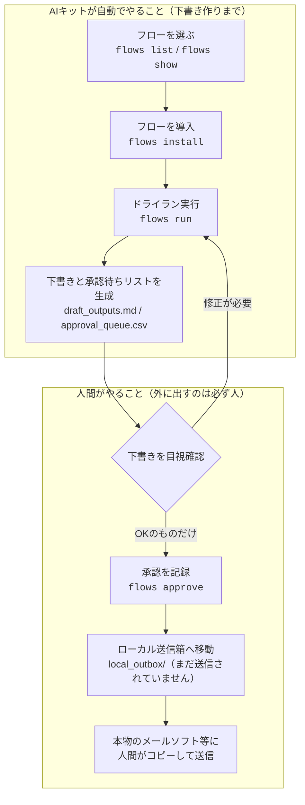
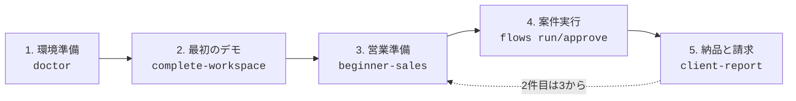
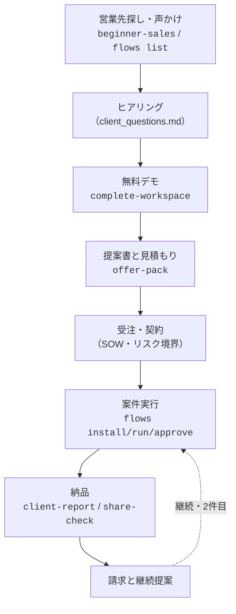

# AI Automation Starter Kit 使い方マニュアル

このマニュアルは、全コマンドの操作説明書です。読者として想定しているのは、「AIエージェント（指示を受けて作業を進めてくれるAIのこと）を触り始めたばかりで、副業として中小企業に業務自動化を提案したい」という方です。

各コマンドの出力例は、すべてこのキットを実際に動かして得たものです（バージョン 0.1.0 時点）。

- はじめての方は、先に [はじめかた（GETTING_STARTED.ja.md）](GETTING_STARTED.ja.md) を読んでください。このマニュアルは「困ったときに該当コマンドの節だけ引く」使い方で十分です。
- 商談の進め方（営業〜請求）は [中小企業への自動化提案チュートリアル](TUTORIAL_SME_PROPOSAL.ja.md) にまとまっています。
- ほかのドキュメントを探すときは [ドキュメント索引（INDEX.md）](INDEX.md) を使ってください。旧世代の文書は [アーカイブ](archive/README.md) に保管されています。

## 大前提: 安全設計

このキットは**外部に何も送信しません**。メール送信・チャット投稿・本番システムの更新は行わず、すべて「下書き」と「承認待ちリスト」としてファイルに出力します（dry-run＝ドライラン、本番実行しないお試し実行）。実際の送信は、必ず人間が内容を確認してから、人間の手で本物のツールから行います。



この図は、この自動化の仕組みの全体像です。上の枠（AIキット）が作るのは「下書きと確認リスト」までで、外部への送信機能はそもそも存在しません。下の枠のとおり、確認・承認して外に出すのは必ず人間です。だから初心者が試しても、お客様に迷惑をかける事故が起きません。

生成物は基本的に `--output` で指定したフォルダに書き出されます。このマニュアルでは `.tmp/` 配下（Gitに入らない作業用フォルダ）を使います。

---

## 1. インストール

```bash
git clone https://github.com/goonobu-dot/ai-automation-starter-kit.git
cd ai-automation-starter-kit
python3 -m venv .venv
source .venv/bin/activate
python3 -m pip install --upgrade pip setuptools
python3 -m pip install -e .
```

- `venv` は、このプロジェクト専用の仮想環境（他の環境を汚さない作業部屋）です。Windows (PowerShell) では4行目を `.venv\Scripts\Activate.ps1` に読み替えてください。
- `pip install -e .` で `ai-automation-kit` コマンドが使えるようになります。

確認:

```bash
ai-automation-kit --version
```

実行結果（実出力）:

```text
ai-automation-kit 0.1.0
```

---

## 2. beginner — 初心者ナビ（5段階）

いま自分がどの段階にいて、次に何をすべきかを日本語で表示します。**迷子になったら、いつでもこのコマンドに戻ってください。**



この図は、副業で最初の1案件を完了するまでの5段階のロードマップです。`beginner` コマンドの5段階と同じ並びです。1案件を終えたら、段階3（営業準備）に戻って2件目を繰り返します。

```bash
ai-automation-kit beginner
```

実行結果（実出力）:

```text
# 初心者ナビ（副業で最初の 1 案件を完了するまでの 5 段階）

いまのあなたの段階を選んで、`ai-automation-kit beginner --step 番号` と入力してください。

1. 環境準備 — パソコンにこのキットを入れて、正しく動く状態にします。
2. 最初のデモ — お客様に見せられるデモ一式を、まず自分のパソコンで作ってみます。
3. 営業準備 — 最初のお客様（中小企業）に見せる営業資料と提案書を用意します。
4. 最初の案件実行 — 受注した案件の自動化フロー（作業手順のセット）を実際に動かします。
5. 納品と請求 — 成果物をお客様に渡し、報告書を添えて請求までつなげます。
```

段階を指定すると、「やること・実行するコマンド・開くファイル・次の一歩」が表示されます。

```bash
ai-automation-kit beginner --step 3
```

| オプション | 意味 |
|---|---|
| `--step 1..5` | 表示する段階の番号。省略すると全体ナビを表示します |

---

## 3. doctor — 環境診断

Pythonのバージョン・書き込み権限・gitの有無・パッケージの導入状態などを診断し、問題があれば**日本語の対処法つき**でレポートします。コマンドがうまく動かないときは、まずこれを実行してください。

```bash
ai-automation-kit doctor --output .tmp/doctor
```

実行結果（実出力）:

```text
status=warning
report=.tmp/doctor/doctor_report.md
```

`doctor_report.md` の中身（実出力・抜粋）:

```text
| Check | Status | Detail |
|---|---|---|
| `python_version` | `pass` | 3.9.6 |
| `pip_available` | `pass` | pip or pip3 on PATH |
| `output_writable` | `pass` | .tmp/doctor |
| `git_available` | `pass` | git on PATH |
| `github_token` | `warn` | GITHUB_TOKEN is not set; ... |
| `package_installed` | `pass` | ai_automation_kit package is importable |
```

- `status=ready` … 問題なし / `warning` … 動くが注意あり / `blocked` … 直すまで先に進まないでください。
- `pass` 以外の項目には、レポート内の「対処法（日本語）」に直し方が書かれています。
- `GITHUB_TOKEN` の警告は無視して構いません（GitHub検索を多用する場合だけ設定します）。

| オプション | 意味 |
|---|---|
| `--output`（必須） | レポートの出力先フォルダ |
| `--check-github` | GitHub APIへの接続テストも行う |

---

## 4. complete-workspace — デモ一式のワンコマンド生成

お客様に見せるデモサイト・提案資料・報告書・納品チェックリストまで、商談に必要な一式をまとめて生成します。**最初のデモはこのコマンド1つで作れます。**

```bash
ai-automation-kit complete-workspace --flow-id invoice-document-followup --client-type local-business --niche accounting --output .tmp/complete-accounting
```

実行結果（実出力）:

```text
final_delivery_guide=.tmp/complete-accounting/FINAL_DELIVERY_GUIDE.md
completion_checklist=.tmp/complete-accounting/completion_checklist.md
client_demo_package=.tmp/complete-accounting/client_demo_package/client_demo_package.zip
status=ready_to_share
```

30以上のファイルが生成されますが、まず開くのは次の3つです。

| ファイル | 用途 |
|---|---|
| `client_command_center.html` | 生成物全体の案内板（ブラウザで開く） |
| `demo_site/index.html` | お客様に見せるデモ画面 |
| `FINAL_DELIVERY_GUIDE.md` | どの生成物をどの順で使うかの1枚ガイド |

| オプション | 意味 |
|---|---|
| `--flow-id` | 対象フローのID（`flows list` で確認。省略時は `--industry` から推定） |
| `--industry` | 業種（既定: finance） |
| `--client-type` | 顧客タイプ（既定: local-business） |
| `--niche` | 業種の細分野（既定: accounting） |
| `--approver` | 承認者名（既定: local-operator） |
| `--output`（必須） | 出力先フォルダ |

---

## 5. flows — 業務フローの導入と実行

72種類の業務自動化フロー（作業手順のセット）を、一覧表示 → 導入 → 検証 → ドライラン実行 → 承認、の順で操作します。

### 5.1 flows list — 一覧

```bash
ai-automation-kit flows list                    # 全72フロー
ai-automation-kit flows list --industry finance # 業種で絞り込み
```

`--industry finance` の実行結果（実出力）:

```text
invoice-document-followup	finance	document	Invoice and Document Follow-up
expense-policy-check	finance	approval	Expense Policy Check
accounts-payable-invoice-capture	finance	document	Accounts Payable Invoice Capture
invoice-approval-reminder	finance	approval	Invoice Approval Reminder
cashflow-weekly-forecast	finance	reporting	Cashflow Weekly Forecast
receipt-missing-followup	finance	communication	Receipt Missing Follow-up
budget-variance-explanation	finance	reporting	Budget Variance Explanation
count=7
```

列は左から「フローID・業種・ジャンル・名前」です。`--genre` でジャンル絞り込みもできます。

### 5.2 flows show — 詳細表示

```bash
ai-automation-kit flows show invoice-document-followup
```

実行結果（実出力・抜粋）:

```json
{
  "id": "invoice-document-followup",
  "name": "Invoice and Document Follow-up",
  "industry": "finance",
  "summary": "Track missing invoices or documents, draft follow-up messages, and create a weekly status report.",
  "tools": ["Google Sheets", "Gmail / Outlook", "Slack / Teams"],
  "sample_columns": ["client", "missing_document", "due_date", "owner", "status"]
}
```

`steps` には各手順と、どこに人間の承認が必要か（approval point）が書かれています。

### 5.3 flows install — 導入

フロー一式（設定・サンプルデータ・操作画面・手順書）を作業フォルダに展開します。

```bash
ai-automation-kit flows install invoice-document-followup --output .tmp/first-job
```

実行結果（実出力）:

```text
flow_project=.tmp/first-job
flow_id=invoice-document-followup
workflow_map=.tmp/first-job/workflow_map.mmd
flow_yaml=.tmp/first-job/flow.yaml
flow_diagram=.tmp/first-job/flow_diagram.html
```

案件で使うときは、`sample_data/input.csv` をお客様のマスキング済みデータ（氏名などを伏せたデータ）の形式に合わせて編集します。

#### flows diagram — お客様向けのフロー図解

フローの仕組みをお客様向けに図解した1枚のHTMLを単独で生成できます。承認ポイント（人間が確認する場所）の説明に便利です。

```bash
ai-automation-kit flows diagram invoice-document-followup --output .tmp/diagram
```

実行結果（実出力）:

```text
flow_diagram=.tmp/diagram/flow_diagram.html
```

できあがった `flow_diagram.html` は、フォルダの中から探してダブルクリックすると、ブラウザで図として開きます。ネット接続は不要で、そのまま印刷してお客様に渡すこともできます。ターミナルから開く場合は `open .tmp/diagram/flow_diagram.html`（Windowsは `start`、Linuxは `xdg-open`）です。

### 5.4 flows validate — 検証

必要なファイルが揃っているかを確認します。`run` の前に実行する習慣をつけてください。

```bash
ai-automation-kit flows validate .tmp/first-job
```

実行結果（実出力）:

```text
status=ready
```

`status=missing_files` の場合は、続く `missing=` 行に不足ファイルが表示されます。

### 5.5 flows run — ドライラン実行

サンプルデータを処理し、下書き・作業キュー・承認待ちリストを生成します。**外部には何も送信されません。**

```bash
ai-automation-kit flows run .tmp/first-job
```

実行結果（実出力）:

```text
automation_status=succeeded
rows_processed=1
work_queue=.tmp/first-job/automation_output/work_queue.csv
draft_outputs=.tmp/first-job/automation_output/draft_outputs.md
approval_queue=.tmp/first-job/automation_output/approval_queue.csv
status_report=.tmp/first-job/automation_output/status_report.md
```

- `draft_outputs.md` … 生成された下書き。**必ず自分の目で読んでください。**
- `approval_queue.csv` … 外部送信に相当するステップの承認待ち一覧。
- `--mode` オプションは `dry-run` のみです（本番送信モードは存在しません。これは仕様です）。

### 5.6 flows approve — 人間承認

下書きを目視確認したうえで、承認の記録を残します。承認されたものはローカルの送信箱（`local_outbox/`）に移動しますが、**自動送信はされません**。

```bash
ai-automation-kit flows approve .tmp/first-job --approver yamada@example.com
```

実行結果（実出力）:

```text
approval_status=approved
approved_items=2
outbox=.tmp/first-job/local_outbox/email_drafts.md
outbox=.tmp/first-job/local_outbox/slack_messages.md
```

- `--approver` には、承認した人の名前かメールアドレスを入れます（誰が確認したかの記録になります）。
- 最後の工程は人間です: `local_outbox/` の下書きを最終確認し、本物のメールソフト等に**人間がコピー＆ペーストして送信**します。

> フロー実行の流れ全体（受注〜納品の文脈つき）は [チュートリアル第6章](TUTORIAL_SME_PROPOSAL.ja.md) を見てください。

---

## 6. client-report / package-client-demo — 納品

### 6.1 client-report — お客様向け報告書

実行済みのフロープロジェクトから、お客様向けの実施報告書を生成します。

```bash
ai-automation-kit client-report --flow-project .tmp/first-job --output .tmp/delivery
```

実行結果（実出力）:

```text
client_report=.tmp/delivery/client_report.md
status=ready
```

報告書には、実行結果の要約・証跡ファイルの一覧・お客様に確認してもらう質問（継続/修正/中止の判断）が含まれます。英語見出しで生成されるので、[AI用プロンプト集](AI_PROMPTS.ja.md) の「納品報告書の文章化」で日本語に仕上げてください。

### 6.2 package-client-demo — 納品用ZIP

納品物一式を1つのZIP（圧縮ファイル）にまとめます。

```bash
ai-automation-kit package-client-demo --source .tmp/first-job --output .tmp/delivery-package
```

実行結果（実出力）:

```text
client_demo_package=.tmp/delivery-package/client_demo_package.zip
file_count=23
```

### 6.3 share-check — 共有前の安全確認

ZIPを送る前に、秘密情報らしき文字列やローカルパスが混ざっていないかを確認します。

```bash
ai-automation-kit share-check --source .tmp/delivery-package --output .tmp/share-check
```

実行結果（実出力）:

```text
share_check=.tmp/share-check/share_check.md
status=ready
```

`status=blocked` の場合は、**直すまで絶対に共有しないでください。**

---

## 7. 営業系コマンド

営業から請求までの1案件の流れと、各場面で使うコマンドの対応は次のとおりです。



この図は、1案件の商談の流れです。前半（営業〜契約）で使うのがこの節の営業系コマンド、後半（実行〜納品）は第5〜6節のコマンドです。実践手順の詳細は [チュートリアル](TUTORIAL_SME_PROPOSAL.ja.md) にあります。

### 7.1 beginner-sales — 初心者向け営業パック

ヒアリングシート・1枚提案書・価格メニュー・声かけ文例・納品チェックリストなど、営業に必要な資料一式を生成します。

```bash
ai-automation-kit beginner-sales --flow-id invoice-document-followup --client-type local-business --niche accounting --output .tmp/beginner-sales
```

実行結果（実出力）:

```text
beginner_sales=.tmp/beginner-sales/README.md
flow_gallery=.tmp/beginner-sales/flow_gallery.html
selected_demo=.tmp/beginner-sales/selected_flow_demo.html
proposal=.tmp/beginner-sales/proposal_one_pager.md
score=100
```

主な生成物:

| ファイル | 用途 |
|---|---|
| `client_questions.md` | ヒアリングシート（読み上げるだけで使えます） |
| `proposal_one_pager.md` | 1枚もの提案書のひな形 |
| `price_menu.md` | 価格メニュー（相場の目安: PoC 5〜15万円、月次 1〜3万円/月 ほか）と価格の決め方 |
| `outreach_messages.md` | 声かけ・フォローアップ・お礼メールの文例 |
| `roi_simple_calculator.csv` | 削減効果の簡易計算シート |
| `client_delivery_checklist.md` | 納品チェックリスト |

### 7.2 offer-pack — 提案書・SOWの正式セット

提案書・作業範囲記述書（SOW＝やること/やらないことの合意書）・価格モデル・リスク境界を生成します。受注前の正式な提案に使います。

```bash
ai-automation-kit offer-pack --business-area operations --client-type small-business --source-output .tmp/complete-accounting --output .tmp/offer-pack
```

実行結果（実出力）:

```text
offer_pack=.tmp/offer-pack/README.md
proposal=.tmp/offer-pack/proposal.md
statement_of_work=.tmp/offer-pack/statement_of_work.md
status=ready
```

- `--source-output` には、`complete-workspace` や `onboard` の出力フォルダを指定します（その内容を提案の根拠として参照します）。
- `risk_boundaries.md`（保証しないこと・禁止事項）は契約前に必ずお客様と共有してください。

### 7.3 business-launch — 開業スターターパック

「何を売るか」から決めたい人向けに、推奨フローの選定と最初のオファー（売り物の定義）を生成します。

```bash
ai-automation-kit business-launch --industry finance --client-type local-business --niche accounting --output .tmp/business-launch
```

実行結果（実出力）:

```text
business_launch=.tmp/business-launch/START_HERE_BUSINESS_LAUNCH.md
first_client_offer=.tmp/business-launch/first_client_offer.md
recommended_flow=invoice-document-followup
status=ready
```

---

## 8. その他のコマンド

上記以外にも多くのコマンドがあります（`ai-automation-kit --help` で一覧表示）。最初の1案件には不要なので、必要になってから開いてください。

| 分類 | 主なコマンド | 参考ドキュメント |
|---|---|---|
| クイックスタート | `quickstart`, `install-bundle`, `demo-site` | [はじめかた](GETTING_STARTED.ja.md) |
| セットアップ相談 | `guided-setup`, `guided-review`, `grill-me`, `connector-doctor` | [連携設定ガイド](CONNECTOR_SETUP_GUIDE.ja.md) |
| 実運用への橋渡し | `flow-export`, `deployment-pack`, `runtime-safety` ほか | [実運用セットアップガイド](REAL_WORLD_SETUP_GUIDE.ja.md), [実行ブリッジ](EXECUTION_BRIDGES.ja.md) |
| クラウド | `cloud-plan` | [クラウド導入ガイド](CLOUD_DEPLOYMENT_GUIDE.ja.md) |
| 応用パック | `command-center`, `skill-pack`, `approval-gate` ほか | [拡充機能ガイド](AUTOMATION_EXPANSION_GUIDE.ja.md) |
| GitHub調査 | `github-discover`, `onboard`, `research-agent` | [GitHub Data](GITHUB_DATA.md) |

---

## 9. トラブルシューティング

| 症状 | 対処 |
|---|---|
| `ai-automation-kit: command not found` | 仮想環境が有効か確認（`source .venv/bin/activate`）。それでも駄目ならリポジトリ直下で `pip install -e .` を再実行 |
| コマンドがエラーで止まる | まず `ai-automation-kit doctor --output .tmp/doctor` を実行し、レポートの「対処法（日本語）」に従う |
| `flows run` が失敗する | `flows validate <フォルダ>` で不足ファイルを確認。フォルダを壊した場合は `flows install` からやり直すのが早いです |
| `flows show` でエラーになる | `flows list` でIDの綴りを確認（IDはハイフン区切りの英語です） |
| 生成物に社内情報が混ざっていないか不安 | 共有前に必ず `share-check` を実行。`blocked` なら共有しない |
| 何をすればいいか分からない | `ai-automation-kit beginner` に戻る。読み物なら [はじめかた](GETTING_STARTED.ja.md) へ |
| GitHub検索系が失敗する | ネット接続を確認。頻繁に使うなら `export GITHUB_TOKEN=...`（GitHubの認証キー）を設定 |

それでも解決しないときは [FAQ](FAQ.ja.md) を確認するか、GitHubのIssueで質問してください。

## 関連ドキュメント

- [はじめかた（唯一の入口）](GETTING_STARTED.ja.md)
- [中小企業への自動化提案チュートリアル](TUTORIAL_SME_PROPOSAL.ja.md)
- [AI用プロンプト集](AI_PROMPTS.ja.md)
- [ドキュメント索引（INDEX）](INDEX.md) / [アーカイブ](archive/README.md)
- [ブラウザ版マニュアル（クリックで開きます）](https://goonobu-dot.github.io/ai-automation-starter-kit/manual.ja.html) — このマニュアルの要約版がWebページとして開きます。手元の `docs/manual.ja.html` をダブルクリックしても同じものが開きます

> 注意: このキットは収益を保証するものではありません。本マニュアルの金額はすべて「相場の目安」です。
