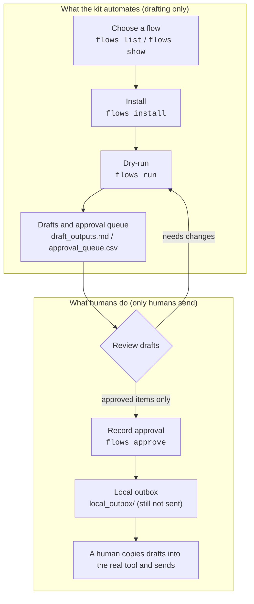

# AI Automation Starter Kit User Manual

This is the operating manual for every core command. The primary audience is beginners who want to propose small, safe business automation projects to small and medium companies as a side business.

This is a concise English edition. The Japanese edition ([USER_MANUAL.ja.md](USER_MANUAL.ja.md)) is the full version with real command outputs for every command; both share the same chapter structure.

- New here? Read the Japanese entrance guide [GETTING_STARTED.ja.md](GETTING_STARTED.ja.md), or run the English quick start in the [README](../README.md).
- For the end-to-end sales walkthrough (outreach to invoicing), see the tutorial ([TUTORIAL_SME_PROPOSAL.ja.md](TUTORIAL_SME_PROPOSAL.ja.md), Japanese).
- Looking for another document? Use the [Documentation Index](INDEX.md). Older documents live in the [archive](archive/README.md).

## The Safety Model

This kit **never sends anything externally**. Every run is a dry-run: it drafts messages, builds work queues and approval lists, and writes reports to local files. A human reviews and approves the drafts, and a human sends them from the real tool.



The kit's job ends at drafts and checklists; there is no external send capability at all. Reviewing, approving, and sending are always human steps. That is why a beginner cannot accidentally send anything to a client.

## 1. Install

```bash
git clone https://github.com/goonobu-dot/ai-automation-starter-kit.git
cd ai-automation-starter-kit
python3 -m venv .venv
source .venv/bin/activate
python3 -m pip install --upgrade pip setuptools
python3 -m pip install -e .
ai-automation-kit --version   # -> ai-automation-kit 0.1.0
```

## 2. beginner — 5-step navigator

Shows where you are on the road to your first paid project and what to do next. The output is in Japanese.

```bash
ai-automation-kit beginner            # overview of the 5 steps
ai-automation-kit beginner --step 3   # details for one step (1..5)
```

Steps: 1 environment setup, 2 first demo, 3 sales preparation, 4 first project execution, 5 delivery and invoicing. After finishing a project, loop back to step 3 for the next client.

## 3. doctor — environment diagnosis

Checks Python version, write permissions, git, and package installation, and reports remedies (in Japanese) for anything that fails. Run this first whenever a command misbehaves.

```bash
ai-automation-kit doctor --output .tmp/doctor
# -> status=ready|warning|blocked, report=.tmp/doctor/doctor_report.md
```

`warning` (for example, `GITHUB_TOKEN` not set) is safe to ignore for local work. Fix `blocked` items before continuing. Add `--check-github` to also test GitHub API connectivity.

## 4. complete-workspace — one-command demo workspace

Generates a full client-facing package: demo site, sales assets, reports, and delivery checklists.

```bash
ai-automation-kit complete-workspace --flow-id invoice-document-followup \
  --client-type local-business --niche accounting --output .tmp/complete-accounting
# -> FINAL_DELIVERY_GUIDE.md, completion_checklist.md, client_demo_package.zip, status=ready_to_share
```

Open `client_command_center.html` (overview menu), `demo_site/index.html` (what you show the client), and `FINAL_DELIVERY_GUIDE.md` first.

## 5. flows — install and run automation flows

72 ready-made dry-run flows. The lifecycle is list → show → install → validate → run → approve.

```bash
ai-automation-kit flows list --industry finance      # list (omit filter for all 72)
ai-automation-kit flows show invoice-document-followup
ai-automation-kit flows diagram invoice-document-followup --output .tmp/diagram
#   -> flow_diagram=.tmp/diagram/flow_diagram.html (client-friendly diagram of the flow)
ai-automation-kit flows install invoice-document-followup --output .tmp/first-job
#   -> flow.yaml, workflow_map.mmd, flow_diagram.html, sample_data/, operator_ui/
ai-automation-kit flows validate .tmp/first-job      # -> status=ready
ai-automation-kit flows run .tmp/first-job           # dry-run only
#   -> automation_output/{work_queue.csv, draft_outputs.md, approval_queue.csv, status_report.md}
# Read draft_outputs.md with your own eyes, then:
ai-automation-kit flows approve .tmp/first-job --approver you@example.com
#   -> local_outbox/email_drafts.md etc. (approved, still NOT sent)
```

`flows run` accepts only `--mode dry-run` — a production send mode does not exist, by design. After `approve`, a human copies the outbox drafts into the real mail or chat tool.

## 6. Delivery — client-report / package-client-demo / share-check

```bash
ai-automation-kit client-report --flow-project .tmp/first-job --output .tmp/delivery
#   -> client_report.md (summary, evidence list, continue/revise/stop questions)
ai-automation-kit package-client-demo --source .tmp/first-job --output .tmp/delivery-package
#   -> client_demo_package.zip (file_count=23 in our run)
ai-automation-kit share-check --source .tmp/delivery-package --output .tmp/share-check
#   -> status=ready|warning|blocked
```

Always run `share-check` before sharing anything. If it reports `blocked`, do not share until it is fixed.

## 7. Sales commands — beginner-sales / offer-pack / business-launch

```bash
ai-automation-kit beginner-sales --flow-id invoice-document-followup \
  --client-type local-business --niche accounting --output .tmp/beginner-sales
#   -> client_questions.md (discovery sheet), proposal_one_pager.md, price_menu.md,
#      outreach_messages.md, roi_simple_calculator.csv, client_delivery_checklist.md

ai-automation-kit offer-pack --business-area operations --client-type small-business \
  --source-output .tmp/complete-accounting --output .tmp/offer-pack
#   -> proposal.md, statement_of_work.md, pricing_model.md, risk_boundaries.md

ai-automation-kit business-launch --industry finance --client-type local-business \
  --niche accounting --output .tmp/business-launch
#   -> START_HERE_BUSINESS_LAUNCH.md, first_client_offer.md, recommended flow

ai-automation-kit report-automation --report-type monthly --client-type local-business \
  --niche construction --output .tmp/monthly-report-pack
#   -> START_HERE_REPORT_AUTOMATION.md, ai_agent_prompt.md,
#      05_grill_me_questions/questions.md, 07_approval/approval_checklist.md
```

Price figures in the generated templates are market guidelines for Japan (for example, a first paid PoC at 50k–150k JPY; monthly support 10k–30k JPY), not guarantees. No income is guaranteed. Keep the paid PoC scope small: one workflow, one sample input, one human approver.

`report-automation` is a concrete side-business offer: the client places past completed reports in `01_past_outputs/`, current materials in `02_current_materials/`, and the AI drafts a daily, weekly, or monthly report. If facts are unclear, it asks one GrillMe-style question at a time. Final submission stays behind human approval. See [Report Automation Guide](REPORT_AUTOMATION_GUIDE.md).

`report-wizard` is the resumable follow-up when you want the kit to inspect approved files, ask the setup questions one at a time, build a reviewable draft workspace, and reopen the session later without losing state. The shortest path is `init -> inspect -> confirm -> answer -> status -> build -> approve`, and `serve` opens the same local session in a localhost browser view. Use [Report Wizard Manual](report-automation-wizard.html) for the browser guide and command-by-command examples.

## 8. Other commands

Run `ai-automation-kit --help` for the full list (quickstart, guided-setup, cloud-plan, flow-export, github-discover, and more). See the [Documentation Index](INDEX.md) for the matching guides: [Report Automation Guide](REPORT_AUTOMATION_GUIDE.md), [Real-World Setup](REAL_WORLD_SETUP_GUIDE.md), [Connector Setup](CONNECTOR_SETUP_GUIDE.md), [Execution Bridges](EXECUTION_BRIDGES.md), [Automation Expansion](AUTOMATION_EXPANSION_GUIDE.md), [Cloud Deployment](CLOUD_DEPLOYMENT_GUIDE.md).

## 9. Troubleshooting

| Symptom | Fix |
|---|---|
| `command not found` | Activate the venv (`source .venv/bin/activate`), then `pip install -e .` from the repo root |
| A command errors out | Run `doctor --output .tmp/doctor` and follow the remedies in the report |
| `flows run` fails | Run `flows validate <dir>`; reinstall with `flows install` if files are missing |
| Unknown flow id | Check spelling with `flows list` |
| Unsure if output is safe to share | Run `share-check`; never share on `blocked` |
| Lost | Run `ai-automation-kit beginner` |

See also the [FAQ](FAQ.md). Related: [Beginner Route Map](BEGINNER_ROUTE_MAP.md), [Selling Automation Guide](SELLING_AUTOMATION_GUIDE.md), [Client Demo Script](CLIENT_DEMO_SCRIPT.md), [HTML manual](manual.html), [Report Wizard Manual](report-automation-wizard.html), [archive](archive/README.md).
