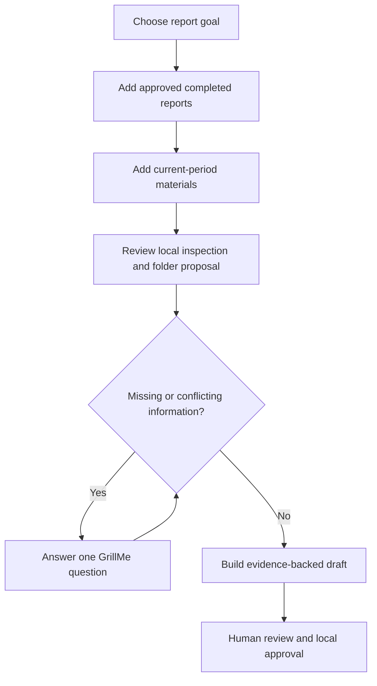

# Report Automation Onboarding Wizard Implementation Plan

> **For agentic workers:** REQUIRED SUB-SKILL: Use superpowers:subagent-driven-development (recommended) or superpowers:executing-plans to implement this plan task-by-task. Steps use checkbox (`- [ ]`) syntax for tracking.

**Goal:** Build a beginner-first local browser and CLI assistant that turns approved past reports and current materials into a resumable, evidence-backed daily, weekly, or monthly report automation workspace.

**Architecture:** A shared Python core owns safe intake, extraction, classification, session state, GrillMe questions, drafting, provenance, and approval. A localhost-only HTTP adapter and browser UI call that core, while nested CLI commands expose the same operations to AI agents and advanced users. Japanese and English HTML manuals remain independent static artifacts suitable for local use and GitHub Pages.

**Tech Stack:** Python 3.9+ standard library, optional `pypdf`, `argparse`, `http.server`, HTML/CSS/JavaScript, pytest, Mermaid source, GitHub Pages-compatible static HTML.

---

## File Map

- Create `src/ai_automation_kit/core/report_intake.py`: bounded local file discovery, extraction, hashing, classification, and quarantine decisions.
- Create `src/ai_automation_kit/core/report_wizard.py`: session state machine, folder and schema proposal, one-question-at-a-time interview, draft, provenance, and approval.
- Create `src/ai_automation_kit/core/report_wizard_server.py`: localhost server, token validation, bounded upload handling, and JSON endpoints.
- Create `src/ai_automation_kit/core/report_wizard_ui.py`: localized browser application HTML, CSS, and JavaScript renderer.
- Modify `src/ai_automation_kit/cli.py`: nested `report-wizard` commands and user-facing status output.
- Create `tests/test_report_intake.py`: input safety and extraction tests.
- Create `tests/test_report_wizard.py`: session, question, draft, provenance, and approval tests.
- Create `tests/test_report_wizard_server.py`: local-request, token, upload, and endpoint tests.
- Modify `tests/test_cli.py`: parser and end-to-end CLI tests.
- Create `docs/report-automation-wizard.ja.html`: Japanese-only beginner manual with an accessible flow diagram.
- Create `docs/report-automation-wizard.html`: English-only beginner manual with an accessible flow diagram.
- Create `docs/report-automation-wizard-flow.mmd`: reusable Mermaid flow source.
- Modify `README.md`, `docs/INDEX.md`, `docs/USER_MANUAL.ja.md`, `docs/USER_MANUAL.md`, `docs/manual.ja.html`, `docs/manual.html`, and both report automation guides: navigation and usage.
- Modify `scripts/release_smoke.py`, `scripts/public_release_audit.py`, `tests/test_public_readiness.py`, and `CHANGELOG.md`: release contract.

### Task 1: Safe Local Intake and File Extraction

**Files:**
- Create: `src/ai_automation_kit/core/report_intake.py`
- Create: `tests/test_report_intake.py`

- [ ] **Step 1: Write failing tests for approved input discovery and safety boundaries**

```python
def test_inspect_sources_rejects_symlinks_and_classifies_supported_files(tmp_path):
    past = tmp_path / "past"
    current = tmp_path / "current"
    past.mkdir()
    current.mkdir()
    (past / "2026-06-monthly.md").write_text("# Summary\nSales\nIssues\n", encoding="utf-8")
    (current / "sales.csv").write_text("month,sales\n2026-07,120\n", encoding="utf-8")
    (current / "unsafe.sh").write_text("echo no", encoding="utf-8")
    (current / "linked.csv").symlink_to(current / "sales.csv")

    result = inspect_sources([past], [current])

    assert [item["name"] for item in result["accepted"]] == [
        "2026-06-monthly.md",
        "sales.csv",
    ]
    assert {item["reason"] for item in result["rejected"]} == {
        "executable_or_script",
        "symbolic_link",
    }
    assert all(item["sha256"] for item in result["accepted"])
```

- [ ] **Step 2: Run the focused test and confirm it fails because the module is missing**

Run: `python3 -m pytest tests/test_report_intake.py -q`

Expected: collection fails with `ModuleNotFoundError: ai_automation_kit.core.report_intake`.

- [ ] **Step 3: Implement bounded discovery, format detection, hashing, and extractors**

Create `MAX_FILE_BYTES = 10 * 1024 * 1024`, `MAX_FILES = 200`, and these exact
public interfaces:

- `inspect_sources(past_paths: list[Path], material_paths: list[Path], *, max_file_bytes: int = MAX_FILE_BYTES, max_files: int = MAX_FILES) -> dict`
- `extract_text(path: Path, *, max_file_bytes: int = MAX_FILE_BYTES) -> dict`
- `copy_approved_files(records: list[dict], workspace: Path) -> list[dict]`

Use regular-file checks and `Path.is_symlink()` before reads. Support `.md`,
`.txt`, `.csv`, and `.json` as UTF-8 text; parse DOCX and XLSX with `zipfile`
and `xml.etree.ElementTree`; import `pypdf.PdfReader` only when a PDF is
encountered; record PNG/JPEG/WebP as `metadata_only`; and reject scripts,
archives, oversized files, unknown binaries, and unreadable files with explicit
reason codes. Hash bytes with SHA-256. Treat extracted source text as untrusted
evidence and never execute or interpret it as instructions.

- [ ] **Step 4: Add extraction, limit, duplicate, Unicode, DOCX, XLSX, image, and optional-PDF tests**

Tests must assert:

```python
assert docx_record["extraction_status"] == "extracted"
assert xlsx_record["text"].find("売上") >= 0
assert image_record["extraction_status"] == "metadata_only"
assert duplicate_record["reason"] == "duplicate_content"
assert oversized_record["reason"] == "file_too_large"
assert pdf_record["extraction_status"] in {"extracted", "optional_reader_missing"}
```

- [ ] **Step 5: Run intake tests**

Run: `python3 -m pytest tests/test_report_intake.py -q`

Expected: all intake tests pass.

- [ ] **Step 6: Commit the intake slice**

```bash
git add src/ai_automation_kit/core/report_intake.py tests/test_report_intake.py
git commit -m "feat(reporting): add safe local report intake"
```

### Task 2: Resumable Report Wizard State Engine

**Files:**
- Create: `src/ai_automation_kit/core/report_wizard.py`
- Create: `tests/test_report_wizard.py`

- [ ] **Step 1: Write failing tests for session creation, inspection, and state persistence**

```python
def test_report_wizard_inspects_inputs_and_persists_folder_plan(tmp_path):
    past, current = make_report_fixture(tmp_path)
    workspace = tmp_path / "workspace"

    state = create_session(workspace, "monthly", "ja")
    inspected = inspect_session(workspace, [past], [current])
    reloaded = load_session(workspace)

    assert state["stage"] == "created"
    assert inspected["stage"] == "inspection_ready"
    assert reloaded == inspected
    assert inspected["folder_plan"]["past_completed_reports"]
    assert inspected["schema_proposal"]["sections"]
    assert inspected["current_question"]["id"] == "report_audience"
```

- [ ] **Step 2: Run the wizard test and confirm the missing-module failure**

Run: `python3 -m pytest tests/test_report_wizard.py -q`

Expected: collection fails for `ai_automation_kit.core.report_wizard`.

- [ ] **Step 3: Implement atomic session storage and deterministic stage transitions**

Expose these exact functions:

- `create_session(workspace: Path, report_type: str, language: str = "ja") -> dict`
- `load_session(workspace: Path) -> dict`
- `inspect_session(workspace: Path, past_paths: list[Path], material_paths: list[Path]) -> dict`
- `confirm_folder_plan(workspace: Path, corrections: Optional[dict[str, str]] = None) -> dict`
- `answer_current_question(workspace: Path, answer: str, *, skipped: bool = False) -> dict`
- `build_report_workspace(workspace: Path) -> dict`
- `approve_report(workspace: Path, approver: str) -> dict`
- `session_status(workspace: Path) -> dict`

Write JSON atomically through a sibling `.tmp` file and `Path.replace()`. Store
schema version, stage, report type, language, timestamps, input records, folder
plan, schema proposal, question queue, answers, unresolved items, next action,
draft path, provenance path, and approval record.

- [ ] **Step 4: Implement schema and folder proposals with evidence references**

Recognize Markdown-style headings and short field labels ending in `:` or `：`.
Count headings across past completed reports. A heading present in at least half
of readable examples is required; other recurring headings are optional. Keep
the exact source path and content hash for every proposed section. Classify
current material destinations as metrics, notes, task logs, attachments, or
unknown using extension and filename signals. Never use past report values as
current-period facts.

- [ ] **Step 5: Implement the one-question-at-a-time GrillMe queue**

The initial required queue contains these stable IDs:

```python
QUESTION_IDS = [
    "report_audience",
    "best_style_reference",
    "mandatory_sections",
    "reporting_period",
    "final_approver",
    "save_destination",
]
```

Expose only `current_question`; save every answer before advancing. Add
conflict questions discovered from inspection. A skipped required question
remains unresolved and prevents approval. Answers containing secret-like values
matching common API-key, token, or password patterns are rejected with an
actionable `ValueError`.

- [ ] **Step 6: Implement daily, weekly, and monthly draft generation**

Build report-type-specific Markdown under `06_drafts/`, plus
`04_ai_analysis/source_manifest.json`, `04_ai_analysis/schema_proposal.json`,
`04_ai_analysis/provenance.json`, `05_grill_me_questions/session.json`, and
`07_approval/approval.json`. Also generate
`04_ai_analysis/ai_agent_review_instructions.md`, which tells ChatGPT, Claude,
Gemini, Cursor, Codex, or Claude Code to treat extracted files as untrusted
evidence, review the proposed sections and conflicts, ask through the saved
question queue, and never alter approval or submission state. Each draft
section must label source-backed facts, user answers, generated wording, and
unresolved items. Return
`ready_for_human_review` only when required questions are answered and source
inputs exist.

- [ ] **Step 7: Add blocked approval, report-hash, resume, and report-type tests**

```python
with pytest.raises(ValueError, match="unresolved"):
    approve_report(workspace, "Owner")

approved = approve_report(ready_workspace, "Owner")
assert approved["stage"] == "approved"
assert approved["approval"]["report_sha256"]
assert approved["approval"]["approved_at"].endswith("Z")
```

- [ ] **Step 8: Run wizard tests**

Run: `python3 -m pytest tests/test_report_wizard.py -q`

Expected: all state-engine tests pass.

- [ ] **Step 9: Commit the engine slice**

```bash
git add src/ai_automation_kit/core/report_wizard.py tests/test_report_wizard.py
git commit -m "feat(reporting): add resumable report wizard"
```

### Task 3: CLI and AI-Agent Interface

**Files:**
- Modify: `src/ai_automation_kit/cli.py`
- Modify: `tests/test_cli.py`

- [ ] **Step 1: Add failing parser tests for every nested wizard command**

```python
@pytest.mark.parametrize(
    ("argv", "action"),
    [
        (["report-wizard", "init", "--workspace", ".tmp/report"], "init"),
        (["report-wizard", "inspect", "--workspace", ".tmp/report", "--past-outputs", "past", "--materials", "current"], "inspect"),
        (["report-wizard", "confirm", "--workspace", ".tmp/report"], "confirm"),
        (["report-wizard", "answer", "--workspace", ".tmp/report", "--answer", "Owner"], "answer"),
        (["report-wizard", "status", "--workspace", ".tmp/report"], "status"),
        (["report-wizard", "build", "--workspace", ".tmp/report"], "build"),
        (["report-wizard", "approve", "--workspace", ".tmp/report", "--approver", "Owner"], "approve"),
        (["report-wizard", "serve", "--workspace", ".tmp/report", "--no-open"], "serve"),
    ],
)
def test_parser_accepts_report_wizard_actions(argv, action):
    parser = build_parser()
    args = parser.parse_args(argv)
    assert args.command == "report-wizard"
    assert args.report_wizard_action == action
```

- [ ] **Step 2: Run parser tests and verify they fail with an invalid command**

Run: `python3 -m pytest tests/test_cli.py -k report_wizard -q`

Expected: parser rejects `report-wizard`.

- [ ] **Step 3: Add nested subparsers and command dispatch**

Required command shapes:

```text
report-wizard init --workspace PATH --report-type daily|weekly|monthly --language ja|en
report-wizard inspect --workspace PATH --past-outputs PATH... --materials PATH...
report-wizard confirm --workspace PATH [--correction SOURCE=DEST]...
report-wizard answer --workspace PATH --answer TEXT [--skip]
report-wizard status --workspace PATH [--json]
report-wizard build --workspace PATH
report-wizard approve --workspace PATH --approver NAME
report-wizard serve --workspace PATH [--language ja|en] [--port 0] [--no-open]
```

Print `stage=`, `next_action=`, `current_question=`, and artifact paths when
present. Return exit code 2 for invalid inputs, 1 for safe blocked states, and 0
for successful transitions. Keep the existing `report-automation` command
unchanged.

- [ ] **Step 4: Add an end-to-end CLI resume test**

Run init with `main(["report-wizard", "init", "--workspace", str(workspace)])`,
then inspect, confirm, six separate answer calls, build, status, and approve.
Assert the state file survives separate calls and the final stage is `approved`.

- [ ] **Step 5: Run focused CLI and compatibility tests**

Run: `python3 -m pytest tests/test_cli.py -k "report_wizard or report_automation" -q`

Expected: all selected tests pass.

- [ ] **Step 6: Commit the CLI slice**

```bash
git add src/ai_automation_kit/cli.py tests/test_cli.py
git commit -m "feat(cli): expose report wizard workflow"
```

### Task 4: Localhost Server and Beginner Browser UI

**Files:**
- Create: `src/ai_automation_kit/core/report_wizard_server.py`
- Create: `src/ai_automation_kit/core/report_wizard_ui.py`
- Create: `tests/test_report_wizard_server.py`

- [ ] **Step 1: Write failing tests for local binding, token checks, and state endpoint**

```python
def test_report_wizard_server_requires_session_token(tmp_path):
    server = create_report_wizard_server(tmp_path / "workspace", language="ja", port=0)
    with running_server(server) as base_url:
        with pytest.raises(HTTPError) as error:
            urlopen(base_url + "/api/state?token=wrong")
        assert error.value.code == 403
        payload = json.load(urlopen(base_url + f"/api/state?token={server.session_token}"))
        assert payload["stage"] == "created"
        assert server.server_address[0] == "127.0.0.1"
```

- [ ] **Step 2: Run the server tests and confirm the missing-module failure**

Run: `python3 -m pytest tests/test_report_wizard_server.py -q`

Expected: collection fails for `report_wizard_server`.

- [ ] **Step 3: Implement the localhost adapter and bounded upload endpoint**

Use `ThreadingHTTPServer` bound to `127.0.0.1`. Generate a token with
`secrets.token_urlsafe(24)`. Reject requests with a non-loopback client address,
missing or incorrect token, unsupported methods, bodies larger than 12 MiB,
unsafe filenames, and unknown endpoint names. Save browser-selected files only
under `<workspace>/00_intake/past/` or `<workspace>/00_intake/current/` using
sanitized basename-only names. Expose:

```text
GET  /
GET  /api/state
POST /api/upload?role=past|current
POST /api/inspect
POST /api/confirm
POST /api/answer
POST /api/build
POST /api/approve
```

Every JSON response includes `ok`, `stage`, `next_action`, and either `data` or
an actionable `error` object. Do not log uploaded contents or secrets.

- [ ] **Step 4: Implement the localized browser application**

`render_report_wizard_ui(language, token)` returns one responsive HTML document.
Use seven stable steps: goal, past reports, current materials, review, questions,
draft, approval. Use file inputs, progress navigation, a proposed-folder tree,
warning list, one visible question, and clear text buttons for actions. No
external network dependency is required to operate the page.

Include an accessible CSS flow diagram and a text alternative. Japanese and
English strings live in separate dictionaries and the selected interface does
not mix explanatory languages.

- [ ] **Step 5: Add upload, invalid token, oversized request, transition, and localization tests**

Tests assert that uploads remain inside `00_intake`, path traversal filenames
are sanitized, `/api/inspect` advances state, exactly one question is rendered,
Japanese UI does not contain English instructional paragraphs, and English UI
does not contain Japanese instructional paragraphs.

- [ ] **Step 6: Run server and engine tests**

Run: `python3 -m pytest tests/test_report_wizard_server.py tests/test_report_wizard.py -q`

Expected: all selected tests pass.

- [ ] **Step 7: Commit the browser slice**

```bash
git add src/ai_automation_kit/core/report_wizard_server.py src/ai_automation_kit/core/report_wizard_ui.py tests/test_report_wizard_server.py
git commit -m "feat(reporting): add local setup browser"
```

### Task 5: Japanese and English HTML Manuals and Flow Diagram

**Files:**
- Create: `docs/report-automation-wizard.ja.html`
- Create: `docs/report-automation-wizard.html`
- Create: `docs/report-automation-wizard-flow.mmd`
- Modify: `tests/test_public_readiness.py`

- [ ] **Step 1: Add failing public-readiness tests for independent manuals**

```python
def test_report_wizard_html_manuals_are_language_separated_and_complete():
    ja = (ROOT / "docs/report-automation-wizard.ja.html").read_text(encoding="utf-8")
    en = (ROOT / "docs/report-automation-wizard.html").read_text(encoding="utf-8")
    for required in ["report-wizard", "flow-diagram", "human-approval", "troubleshooting"]:
        assert required in ja
        assert required in en
    assert '<html lang="ja">' in ja
    assert '<html lang="en">' in en
    assert "資料を準備" in ja
    assert "Prepare your files" not in ja
    assert "Prepare your files" in en
    assert "資料を準備" not in en
```

- [ ] **Step 2: Run the manual test and confirm both files are missing**

Run: `python3 -m pytest tests/test_public_readiness.py -k report_wizard_html -q`

Expected: `FileNotFoundError` for the new manual.

- [ ] **Step 3: Create the two standalone HTML manuals**

Both manuals include the same information architecture:

```text
1. What this helps you accomplish
2. Files to prepare
3. Seven-step visual flow
4. What happens on each screen
5. What AI can decide and what requires a person
6. Privacy and local processing
7. CLI and AI-agent commands
8. First paid proof-of-concept example
9. Troubleshooting
10. Related manuals
```

Use a quiet multi-color palette, 8px-or-less radii, visible keyboard focus,
semantic landmarks, `prefers-reduced-motion`, responsive grids, and print CSS.
Do not use nested cards, decorative gradients, or mixed-language navigation.
The flow diagram must show all seven steps and use both shape and text so color
is not the only signal.

- [ ] **Step 4: Add the Mermaid source and text alternative**

The `.mmd` file contains:



- [ ] **Step 5: Run manual readiness tests**

Run: `python3 -m pytest tests/test_public_readiness.py -k report_wizard_html -q`

Expected: the manual tests pass.

- [ ] **Step 6: Commit the manual slice**

```bash
git add docs/report-automation-wizard.ja.html docs/report-automation-wizard.html docs/report-automation-wizard-flow.mmd tests/test_public_readiness.py
git commit -m "docs(reporting): add bilingual wizard manuals"
```

### Task 6: Navigation, Release Contract, and Smoke Coverage

**Files:**
- Modify: `README.md`
- Modify: `docs/INDEX.md`
- Modify: `docs/USER_MANUAL.ja.md`
- Modify: `docs/USER_MANUAL.md`
- Modify: `docs/manual.ja.html`
- Modify: `docs/manual.html`
- Modify: `docs/REPORT_AUTOMATION_GUIDE.ja.md`
- Modify: `docs/REPORT_AUTOMATION_GUIDE.md`
- Modify: `scripts/release_smoke.py`
- Modify: `scripts/public_release_audit.py`
- Modify: `tests/test_public_readiness.py`
- Modify: `CHANGELOG.md`

- [ ] **Step 1: Add failing release-contract assertions**

Require these snippets and files in public audit and readiness tests:

```text
ai-automation-kit report-wizard serve
docs/report-automation-wizard.ja.html
docs/report-automation-wizard.html
report_wizard_state.json
04_ai_analysis/provenance.json
07_approval/approval.json
```

- [ ] **Step 2: Update beginner navigation and bilingual usage explanations**

Make the browser wizard the recommended beginner entry point. Keep
`report-automation` documented as the non-interactive starter-pack command.
Explain in both languages that the wizard copies approved files locally,
unsupported formats remain visible, images are metadata-only without OCR,
answers are saved one at a time, and approval never sends the report.

- [ ] **Step 3: Extend release smoke with a synthetic end-to-end session**

Create two small past Markdown reports and one current CSV in the smoke output.
Run init, inspect, confirm, answer all required questions, build, and approve.
Require the state, schema proposal, provenance, draft, and approval JSON files.
Start the server on port 0 in-process, request `/` and authenticated
`/api/state`, then stop it cleanly.

- [ ] **Step 4: Run audit and smoke checks**

Run: `python3 scripts/public_release_audit.py`

Expected: `public release audit passed`.

Run: `python3 scripts/release_smoke.py --skip-github --output .tmp/release-smoke-report-wizard`

Expected: `release smoke passed: .tmp/release-smoke-report-wizard`.

- [ ] **Step 5: Commit the release slice**

```bash
git add README.md docs scripts tests/test_public_readiness.py CHANGELOG.md
git commit -m "docs(reporting): publish wizard entry points"
```

### Task 7: Browser QA, Security Review, and Full Verification

**Files:**
- Modify only files identified by failing checks or review findings.

- [ ] **Step 1: Run focused tests**

Run: `python3 -m pytest tests/test_report_intake.py tests/test_report_wizard.py tests/test_report_wizard_server.py tests/test_cli.py -q`

Expected: all focused tests pass.

- [ ] **Step 2: Run the full test suite**

Run: `python3 -m pytest -q`

Expected: all tests pass with zero failures.

- [ ] **Step 3: Run static and release checks**

```bash
python3 -m py_compile src/ai_automation_kit/core/report_intake.py src/ai_automation_kit/core/report_wizard.py src/ai_automation_kit/core/report_wizard_server.py src/ai_automation_kit/core/report_wizard_ui.py src/ai_automation_kit/cli.py
git diff --check
python3 scripts/public_release_audit.py
python3 scripts/release_smoke.py --skip-github --output .tmp/release-smoke-report-wizard-final
```

Expected: compilation and diff check are silent; both release checks pass.

- [ ] **Step 4: Inspect browser UI and manuals at desktop and mobile widths**

Launch:

```bash
PYTHONPATH=src python3 -m ai_automation_kit.cli report-wizard serve --workspace .tmp/browser-report-wizard --language ja --port 0
```

Use the browser test tool at 1440x900 and 390x844. Verify the page is nonblank,
the flow and progress controls are visible, text does not overlap, the longest
Japanese and English labels fit, file intake and one-question progression work,
and both static manuals remain language-separated.

- [ ] **Step 5: Perform an independent spec-compliance and code-quality review**

Review against
`docs/superpowers/specs/2026-07-10-report-automation-onboarding-wizard-design.md`.
Reject completion if original files can be modified, external network activity
is required, unsupported inputs disappear silently, more than one question is
shown, approval can bypass unresolved required items, or the manuals mix
languages.

- [ ] **Step 6: Fix review findings with focused regression tests and rerun the affected checks**

Every fix includes a test that fails before the correction and passes after it.
Do not weaken safety assertions to obtain a green suite.

- [ ] **Step 7: Commit final verification fixes when needed**

```bash
git add src/ai_automation_kit/core/report_intake.py src/ai_automation_kit/core/report_wizard.py src/ai_automation_kit/core/report_wizard_server.py src/ai_automation_kit/core/report_wizard_ui.py src/ai_automation_kit/cli.py tests docs README.md CHANGELOG.md scripts
git commit -m "fix(reporting): address wizard review findings"
```

- [ ] **Step 8: Push the completed branch after all checks pass**

Run: `git push origin HEAD`

Expected: the remote branch advances to the verified final commit.
