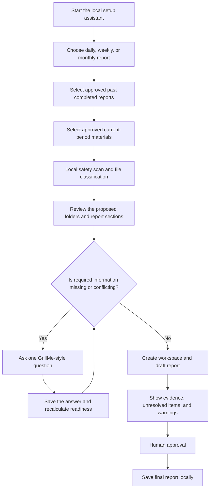

# Report Automation Onboarding Wizard Design

Date: 2026-07-10
Status: Approved direction

## 1. Goal

Turn the existing folder-based report automation pack into a beginner-first
setup assistant. A user supplies approved examples of completed daily, weekly,
or monthly reports plus current-period materials. The system inspects those
files locally, proposes a workspace and report structure, asks one question at
a time when information is missing, and creates a reviewable automation setup.

The system must not change the original source files. It copies only files the
user approves into a new workspace. It never submits or sends a report without
human approval.

## 2. Intended User

The primary user has recently started using ChatGPT, Claude, Gemini, Cursor,
Codex, Claude Code, or another AI assistant. They understand the business task
but may not know folder design, prompts, data extraction, or automation setup.

The secondary user is an experienced operator who wants the same engine
available through a repeatable command-line interface.

## 3. Approaches Considered

### Approach A: CLI-only interactive setup

Advantages:

- Small implementation and dependency surface.
- Easy for AI coding agents to operate.
- Simple to test and automate.

Disadvantages:

- A terminal remains a large first-use barrier.
- File classification and folder proposals are difficult to understand
  visually.

### Approach B: Local browser wizard with a shared CLI engine

Advantages:

- Beginners can select files, review classifications, and answer questions in
  a browser.
- The shared core remains available to AI agents and advanced users through the
  CLI.
- Source data stays on the local computer by default.
- The same state file makes the setup resumable from either interface.

Disadvantages:

- Requires a small localhost server and a larger test surface.
- Local file intake needs strict limits and path validation.

### Approach C: Hosted cloud application

Advantages:

- No local installation after deployment.
- Multi-user access and centralized updates are possible.

Disadvantages:

- Uploading company reports creates privacy, security, and operating-cost
  concerns.
- Authentication, storage, deletion, regional hosting, and compliance become
  prerequisites.
- It raises the first-use barrier for a side-hustle proof of concept.

### Decision

Use Approach B. Build one local engine and expose it through a browser wizard
and CLI commands. Keep cloud deployment outside this first implementation. The
generated workspace may later be connected to an approved cloud process, but
local setup and human review remain the default.

## 4. User Flow



The browser must always show the current step, completed steps, the next action,
and whether the user can safely continue.

## 5. Architecture

### 5.1 Shared onboarding engine

Add a focused report onboarding module under
`src/ai_automation_kit/core/`. It owns:

- session initialization and resumable state;
- safe file discovery and approved-file copying;
- file type detection and classification;
- report schema and workspace proposals;
- GrillMe question progression;
- readiness calculation;
- draft and approval artifact generation.

The engine returns structured dictionaries and writes JSON state. Neither the
browser nor CLI may duplicate business rules.

### 5.2 Local browser wizard

Add a `report-wizard` command that starts an HTTP server bound only to
`127.0.0.1` and opens the default browser unless `--no-open` is supplied.

The server provides:

- a Japanese or English setup screen;
- file and folder path intake;
- classification review and confirmation;
- proposed folder-tree review;
- one-question-at-a-time interview;
- readiness and draft review;
- local approval action.

The server uses a random session token, rejects non-local requests, and does not
provide external upload or cloud sync.

### 5.3 CLI and AI-agent interface

The same workflow is available without a browser:

```text
ai-automation-kit report-wizard init ...
ai-automation-kit report-wizard inspect ...
ai-automation-kit report-wizard answer ...
ai-automation-kit report-wizard status ...
ai-automation-kit report-wizard build ...
ai-automation-kit report-wizard approve ...
ai-automation-kit report-wizard serve ...
```

Every command prints the state, the next action, and paths to the main human and
machine-readable outputs. This allows Codex, Claude Code, Cursor, and other
agents to act as the operator while preserving the same gates.

### 5.4 State model

Store session state in `report_wizard_state.json` with these stages:

```text
created
inputs_selected
inspection_ready
folder_plan_confirmed
questioning
ready_for_draft
ready_for_human_review
approved
```

Blocked states are represented by a reason and next action rather than silently
continuing. The system can be closed and resumed at every stage.

## 6. File Intake and Analysis

### 6.1 Source rules

- Original files are read-only and never modified.
- Only user-approved regular files are copied.
- Symbolic links are rejected.
- Hidden files, executable files, archives, and unknown binary formats are
  quarantined or skipped with a visible explanation.
- File count and size limits are enforced before extraction.
- Every copied file receives a hash and provenance record.

### 6.2 Initial format support

Full text extraction:

- Markdown and plain text
- CSV and JSON
- DOCX
- XLSX
- PDF when the supported PDF reader is installed

Metadata-only intake:

- PNG, JPEG, and WebP images

Unsupported or unreadable files appear in the review screen. The system never
claims to have read content it could not extract. OCR is an optional future
extension and is not implied by image intake.

### 6.3 Classification

Each file receives:

- source role: past completed output or current material;
- likely report period: daily, weekly, monthly, or unknown;
- content role: metrics, notes, attachment, task log, template, or unknown;
- confidence score and reason;
- destination folder proposal;
- extraction status and warning list.

The user can correct every classification before files are copied.

### 6.4 Schema proposal

The engine extracts recurring headings and field labels from past completed
reports. It proposes required sections, optional sections, tone guidance, and
candidate metrics with source references.

The proposal is evidence, not truth. Low-confidence and conflicting structures
become questions. Current-period facts are never inferred from past reports.

## 7. GrillMe Question Loop

The question engine asks exactly one question at a time and saves each answer
immediately. It prioritizes:

1. report period and audience;
2. best past report to use as the style reference;
3. mandatory sections and metrics;
4. conflicting values or dates;
5. reasons for changes that cannot be proven from source files;
6. report approver;
7. final local save destination.

Questions must not request passwords, API keys, access tokens, or unnecessary
personal data. The user can answer, skip, or mark an item as requiring another
person. Skipped required facts remain unresolved and visibly block approval.

## 8. Drafting and Approval

The generated draft separates:

- source-backed facts;
- style or structure inferred from examples;
- user-supplied answers;
- unresolved items;
- generated wording that still requires review.

Every report section links to its source files in a provenance manifest. The
approval record is machine-readable and stores status, approver name, UTC
timestamp, and report hash. Approval does not send, upload, email, or submit the
report. It marks the local artifact as approved.

## 9. HTML Manuals

Create two independent manuals:

- `docs/report-automation-wizard.ja.html`
- `docs/report-automation-wizard.html`

The Japanese manual contains only Japanese navigation and explanations. The
English manual contains only English navigation and explanations. Product names
and literal commands may remain in their original form.

Each manual includes:

- what the system does and does not do;
- what files to prepare;
- a visual end-to-end flow diagram;
- a screenshot-style explanation of each wizard step;
- beginner troubleshooting;
- privacy and approval rules;
- CLI and AI-agent usage;
- a first paid proof-of-concept example;
- links back to the main manual and report automation guide.

The flow diagram is implemented as accessible HTML/CSS, with a text alternative
and Mermaid source in the repository. The manuals work from GitHub Pages and
when opened locally.

## 10. Error Handling

Errors are actionable and include what happened, which file or stage is
affected, and the next safe action. Examples:

- input path does not exist;
- no completed report examples were found;
- file is too large or unsupported;
- PDF reader is unavailable;
- conflicting metrics require confirmation;
- session state is invalid or belongs to another workspace;
- draft cannot be approved while required questions remain.

No error silently drops a file. Recoverable failures preserve state so the user
can resume.

## 11. Testing

Use synthetic fixtures only. Add tests for:

- daily, weekly, and monthly setup;
- safe path validation, symlink rejection, limits, duplicates, and Unicode
  names;
- text, CSV, JSON, DOCX, XLSX, optional PDF, and metadata-only image intake;
- unsupported and unreadable file handling;
- deterministic classification and folder proposals;
- schema extraction with reordered and conflicting sections;
- one-question-at-a-time progression and resume;
- readiness and blocked-state transitions;
- provenance and report hashes;
- enforced approval requirements;
- Japanese and English HTML separation, navigation, flow diagrams, responsive
  layout, and no overlapping text;
- CLI parsing and end-to-end session commands;
- localhost-only server behavior and session-token checks;
- release smoke and public release audit coverage.

Before release, run focused tests, the full test suite, public release audit,
release smoke, Python compilation, diff checks, and browser screenshots at
desktop and mobile widths.

## 12. Acceptance Criteria

The work is complete when a beginner can:

1. launch one command and open the local setup screen;
2. select synthetic example reports and current materials;
3. see what the system could and could not read;
4. correct the proposed file destinations;
5. answer one saved question at a time;
6. resume after closing the setup;
7. generate a daily, weekly, or monthly draft with evidence references;
8. see unresolved risks before approval;
9. approve and save the final report locally without any external send;
10. understand the entire process from a Japanese-only or English-only HTML
    manual and its flow diagram.

The implementation must preserve the existing `report-automation` command and
its generated artifacts for backward compatibility.
